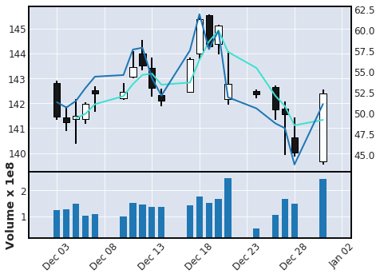

# DeepLearning
## Stock Price Prediction using Deep Learning
### Executive Summary
Stock market’s characteristics move independently at every point in time, i.e. they have a random walk characteristic. Due to this stock market prediction using previous information becomes challenging.Stock market prediction can be categorized into fundamental analysis and technical analysis[1].In fundamental analysis all the elements that affect the intrinsic value of the company are analyzed and technical analysis is used to predict the future stock price through graph analysis. Due to limitation of fundamental analysis, many studies related to stock market prediction using technical analysis have been conducted.[2] 

In recent years, a lot of researches have suggested artificial neural networks(ANNs) to be advantageous in stock market prediction[3-6]. However, since many financial market variables are intertwined with each other directly or indirectly, the deep learning models are used in combination with the technical indicators for stock prediction.

In this project, a stock price prediction model based on convolution neural network(CNN) and technical analysis is proposed to predict increase/decrease of stock prices. CNN is most commonly used to analyze images and can improve learning performance by convolution and pooling processes[7].For applying the CNN, various technical indicators, have been generated as predictors along with candle stick images of monthly data were converted to images of the time series graph.Technical indicators RSI(Relative strength index) and SMA(Simple moving averages)are calculated for the data, further monthly data along with these technical indicators are used to generate the input image. The python library “mpl-finance” is used to achieve input image generation. The code for image and dataset generation can be found in “CandleSticks.py”. The stock price prediction model proposed in this study learns the moving pattern of the independent variables for 1 month and forecasts the increase or decrease in the stock price of the next day. A sample of the input image is shown below.

 
 
 When learning a prediction model, the closing price and technical indicators are considered as input variables, and target variables are set to values expressed as 1 or 0. The target has a closing price of 0 when the closing price at time t-1 is higher than the closing price at time t[2].
 
In this project,LeNet-5 algorithm is used for stock prediction. The code for the data preparation for CNN, CNN architecture and training can be found in “CNN.ipynb”. The 64x64x1 input image is filtered in the first convolution layer by 3x3x3 kernels, with stride of 1 pixel. Then, max pooling is used in the pooling layer to reduce the size of the image as much as possible, taking a 2x2 matrix to minimize the pixel loss and obtain correct characteristic region[8].The second convolution layer filters the output of the first convolution layer using 3x3x3 kernels, with stride of 1 pixel, followed by flattening which is a process of converting a 2D array into one long continuous vector. In the fully connected layer, the entire connection of 128 neural networks is performed, then the connection goes through on output layer that contains only one node. The last layer uses the soft max activation.

